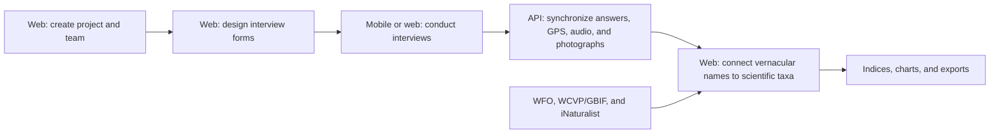

# Padiush Project Assessment

**Assessment date:** 2026-07-18  
**Primary repository:** `/Users/raarevalo96/dev/padiush`  
**Companion repository:** `/Users/raarevalo96/dev/padiush-companion`

## Repository state assessed

### Web platform and API

- Branch: `feature/companion-api`
- Commit: `69a502f`
- Base branch in this repository: `master`
- Branch size relative to `master`: 19 commits, 102 changed files, approximately
  9,251 insertions and 457 deletions.

### Mobile application

- Branch: `master`
- Commit: `4125f82`
- Expo / React Native application with native iOS and Android projects.

The assessment covers committed source at those revisions. The following
untracked files were not considered part of the implementation:

- Web: `.DS_Store`, `public/.DS_Store`, `public/images/`
- Mobile: `.claude/launch.json`

## Executive summary

Padiush is an end-to-end research-data platform for **ethnobotany**, the study
of relationships between people and plants. It supports the full path from
designing a study to producing structured, publication-ready results:

1. Create a research project and assemble a team.
2. Design interview questionnaires.
3. Conduct interviews in the browser or with an offline native mobile app.
4. Synchronize answers, GPS, audio, and photographs.
5. Reconcile vernacular plant names with scientific taxa.
6. Calculate quantitative ethnobiology indices.
7. Export tables, charts, and datasets for publication or further analysis.

The web application is the central research workbench. The separate Padiush
Companion application is intentionally a capture-only field client. Form
design, species reconciliation, analysis, and export remain web-only.

Although the project README calls Padiush a bioinformatics tool, the current
product is more accurately described as a specialized research information and
data-management platform. It does not perform sequence analysis or molecular
bioinformatics.

## Product workflow

## Domain model in plain language

### Project

A project represents one research study. It contains study metadata, a team,
permissions, interview forms, collected interviews, and a scientific species
catalog.

### Team and permissions

Authorization is scoped per project. A user's `ProjectAccess` record connects
the user to a `ProjectCapability` role. The eight permission flags are:

- `manage_project`
- `manage_users`
- `manage_forms`
- `record_data`
- `manage_data`
- `generate_reports`
- `view_catalog`
- `edit_catalog`

The seeded roles are:

- **Administrador del proyecto:** all permissions.
- **Usuario técnico:** data capture, report generation, and catalog access/editing.
- **Usuario de consulta:** report generation and read-only catalog access.

The same project policy is used by session-authenticated web requests and
token-authenticated mobile API requests.

### Interview form

An interview form is a configurable research instrument. It contains ordered
sections and questions. Supported question types are:

- Text
- Number
- Date
- Single choice
- Multiple choice

A section can be repeatable. This allows a single interview to contain several
plant-use records—for example, one repeated set for each plant or reported use.

Two question roles carry special domain meaning:

- `link_to_species`: the answer is a vernacular or reported plant name that
  will later be reconciled with the catalog.
- `is_use_category`: the answer identifies a use category such as food,
  medicine, construction, or culture.

### Interview instance and answers

An `InterviewInstance` represents one interview, conceptually one informant's
responses. It uses a UUID primary key. Each answer is an `InstanceAnswer` tied
to an item and, when relevant, a repeatable-set index.

Answer values are application-encrypted on the server through Laravel's
`encrypted` cast. The server also stores optional capture time and GPS fields.
GPS metadata itself is stored in ordinary database columns rather than through
the encrypted value cast.

### Species catalog and reconciliation

Each project has its own `CatalogSpecies` records. The core relationship in the
product is `InstanceAnswer.catalog_species_id`:

- The mobile or web capture flow records what the informant actually said.
- A researcher later connects that answer to a scientific taxon.
- The original reported name remains preserved for traceability.
- A linked answer becomes a structured use record for analysis and export.

This separation is important: field workers capture raw knowledge first;
taxonomic reconciliation is a later, deliberate research task.

## Web application

### Primary user-facing areas

The authenticated dashboard links to five major modules:

1. **Projects**
   - Create and edit studies.
   - Manage authorship, institution, country, and status fields.
   - Invite collaborators and assign project roles.
   - Accept, decline, and revoke project invitations.

2. **Form Designer**
   - Create and activate/deactivate forms.
   - Add, rename, reorder, and delete sections and items.
   - Configure repeatable sections.
   - Configure options and numeric constraints.
   - Mark species-link and use-category fields.
   - Preview the form before capture.
   - Protect recorded answers when changing an existing structure.

3. **Interviews**
   - Start interviews in the browser.
   - Save answers incrementally.
   - Add and remove repeatable answer sets.
   - Review interviews by form and recorder.

4. **Catalogs**
   - Register scientific taxa.
   - Search and filter by scientific or reported names.
   - Inspect the interview records linked to a species.
   - Maintain taxonomic information with external references.

5. **Data**
   - View raw records in tables.
   - Filter by form, section, recorder, and dates.
   - Summarize categorical, multiple-choice, numeric, and date fields.
   - Reconcile individual or grouped vernacular names with species.
   - Generate quantitative indices, charts, and exports.

### Public and administrative functionality

The web repository also contains:

- Public home, about, contact, privacy, and terms pages.
- SEO metadata and sitemap support.
- Contact email with honeypot spam protection.
- Login, password reset, password confirmation, and email verification.
- Configurable public registration.
- Signed platform registration invitations when public registration is disabled.
- Project invitations that can onboard an unregistered user.
- A system-administrator dashboard for user deletion and registration invites.

### Localization

User-facing web copy is maintained in Spanish, English, and Portuguese. Spanish
is the fallback language. The mobile application uses the same three languages.

## Catalog and taxonomic integrations

The current web branch substantially expands catalog capabilities.

### World Flora Online

World Flora Online is used to:

- Search recognized botanical names.
- Prefill family, genus, epithet, and authority when registering a species.
- Distinguish accepted names, synonyms, and spelling candidates.
- Preview a proposed taxonomy change.
- Adopt a WFO name or its accepted name for an existing catalog entry.
- Record WFO provenance in the species metadata.

### WCVP through GBIF

The platform obtains geographic distribution from Kew's World Checklist of
Vascular Plants through GBIF's public API. Results are grouped into native and
introduced botanical regions and cached in catalog metadata.

### iNaturalist

iNaturalist supplies a credited reference photograph during species
registration. The photograph is used as a visual-confirmation aid:

- The image is not stored by Padiush.
- It is streamed through a same-origin proxy to avoid exposing the researcher's
  IP directly to the image host.
- Only explicitly allowed iNaturalist photo hosts can be fetched.
- Photographer, license, platform, and source-page attribution are displayed.

These external systems assist identification. Padiush remains the project's
record of the adopted taxonomy and the original reported names.

## Analysis and exports

The analytical unit is a **use report**: one informant reported one species for
one use in one use category.

The application implements the following quantitative ethnobiology measures:

- Frequency of Citation (FC)
- Relative Frequency of Citation (RFC)
- Number of Uses (NU)
- Use Value (UV)
- Cultural Importance Index (CI)
- Relative Importance (RI)
- Cultural Value (CV)
- Informant Consensus Factor (ICF/FIC)
- Fidelity Level (FL)

The formulas, edge cases, literature citations, and worked-example test oracle
are documented in `docs/analysis/ethnobotany-indices.md`.

The report interface includes:

- Species-level index tables.
- Use-category consensus tables.
- Fidelity-level results.
- A selectable species-by-index bar chart.
- A species-by-use-category heatmap.
- A species-to-use Sankey diagram.
- SVG and PNG downloads with background, resolution, and grayscale options.
- Citations for the scientific sources defining each measure.

Exports include:

- Custom field selections.
- CSV and Excel output.
- Formula-injection protection for spreadsheet cells.
- Informant-by-species matrices prepared for the `ethnobotanyR` R package.
- A references sheet in Excel index reports.

## Companion API

The branch adds a versioned capture API under `/api/v1`.

### Authentication

Mobile devices exchange email, password, and a device name for a Laravel
Sanctum token. The password is not retained by the mobile app. Tokens have one
`capture` ability; project-level authorization is still checked by the shared
project policy.

Supported token operations are:

- Issue a named device token.
- Revoke the current device token.

### Pull operations

- `GET /me`: current user and projects where the user can record data.
- `GET /projects/{project}/bundle`: active form structures for offline caching,
  optionally incremental through a timestamp cursor.

The device does not download the species catalog. This is consistent with the
capture-only scope.

### Push operations

- `POST /projects/{project}/instances:sync`: batched interview upsert.
- Client-generated UUIDs identify instances and answers.
- Repeating a successfully applied write is intended to be safe.
- An optional request idempotency key caches a whole batch response briefly.
- Results can be created, updated, unchanged, or rejected.

Answer conflicts are resolved per answer by last-writer-wins using device
edit-time. Implausible future timestamps are clamped. Before an accepted newer
write replaces an older answer, the prior encrypted value and species link are
stored in an immutable revision row.

### Media operations

- Register an audio/photo upload intent.
- Obtain a presigned S3/MinIO upload URL.
- Upload bytes directly to object storage.
- Mark the upload complete.
- Fetch interview media and transcription status later.

The server currently permits files up to approximately 500 MB. The mobile
implementation performs one PUT with the full media payload in memory. Despite
some documentation referring to resumable or chunked upload, the current client
does not implement a resumable multipart protocol.

## Mobile application

### Technology

- Expo SDK 57
- React 19.2
- React Native 0.86
- TypeScript
- React Navigation
- Expo SQLite with SQLCipher
- Expo Secure Store
- Expo Location
- Expo Audio
- Expo Image Picker
- Expo File System and Crypto

Native iOS and Android projects are checked in. The application is portrait
oriented and declares tablet support on iOS.

### Current screens and flow

1. **Sign in**
   - Email and password are exchanged for a named device token.

2. **Projects tab**
   - Displays locally cached recordable projects.
   - Pull-to-refresh and an explicit sync action update projects and form bundles.
   - Selecting a project lists its cached active forms.

3. **Interview screen**
   - Starts a local UUID-backed draft.
   - Attempts to capture a GPS fix.
   - Renders all supported form-item types.
   - Supports repeatable sets.
   - Saves each answer locally as it changes.
   - Records audio and takes photographs.
   - Can reopen a previously recorded interview.

4. **Interviews tab**
   - Lists local interviews and their sync status.
   - Shows an answer preview and answer/media counts.
   - Displays the number of drafts in a tab badge.
   - Sends draft interviews and then attempts media upload.

The application also supports light/dark appearance, safe-area handling,
haptic feedback, native date selection, pull-to-refresh, and localized copy.

### Local security

The mobile store contains sensitive informant data and media. The implementation
uses the following protections:

- A random 32-byte SQLCipher key is generated on-device.
- The key is held in Keychain/Keystore through Secure Store.
- The database is opened with that key before any other SQL statement.
- The app checks `PRAGMA cipher_version` and refuses to capture if SQLCipher is
  missing, rather than silently creating a plaintext database.
- Legacy plaintext databases are migrated into an encrypted store.
- Audio/photo bytes are split into database blobs inside the encrypted store.
- Plaintext capture files are deleted after ingestion.
- Uploaded media bytes are deleted locally after the server confirms storage.
- The bearer token is stored in Secure Store; the password is not stored.

Server-side object-storage encryption configuration is not established by the
application source reviewed here. Answers and completed transcript text are
application-encrypted in the relational database, but GPS and most media
metadata are ordinary database fields.

## Branch-specific additions beyond the companion API

The current web branch includes several substantial areas not implied by its
`feature/companion-api` name:

1. **Invite-only registration**
   - System administrators can issue signed platform registration invitations.
   - Project invitations can onboard previously unregistered users.
   - Public registration can be enabled or disabled by environment setting.

2. **Historical-data import**
   - A dry-run-first Artisan command imports a specific Spanish
     `data_ingest.xlsx` workbook.
   - It expects exactly 89 interviews, 2,457 species-use rows, 2,067 legacy
     report IDs, and 190 taxa.
   - It validates sheet structure, critical fields, taxon reconciliation, and
     record fingerprints before and after import.
   - This is a specialized migration tool, not a generic end-user spreadsheet
     importer.

3. **Catalog enrichment**
   - WFO search, registration prefill, accepted-name adoption, and provenance.
   - WCVP/GBIF range lookup.
   - Credited iNaturalist reference photographs.
   - Linked interview records on species pages.
   - Preservation of original reported names in data views.

4. **Supporting fixes**
   - Device timestamp normalization in a non-UTC application timezone.
   - Deterministic capability seeding.
   - Input-tooltip overflow handling.
   - Updated WFO certificate chain.

The branch is therefore a broad integration branch, not only an API branch.
That increases review and deployment risk because companion, authentication,
data migration, and taxonomy changes are coupled.

## Verification performed

### Web backend

Executed inside the application container with an isolated SQLite database and
array mailer:

- **308 tests passed**
- **1,412 assertions**

Coverage includes authorization, forms, interviews, catalogs, name resolution,
reports, exports, invitations, legacy import, token auth, bundles, synchronization,
media, and transcription plumbing.

### Web frontend

Executed inside the Node container:

- **20 test files passed**
- **74 tests passed**

### Mobile

- **27 Jest suites passed**
- **116 tests passed**
- TypeScript check passed.
- ESLint passed.
- Expo Doctor passed 19 of 20 checks.

The mobile Jest output contains several non-failing React `act(...)` warnings in
`HomeScreen` and `DraftsScreen` tests.

Expo Doctor reports 16 Expo SDK 57 packages that are behind the expected patch
versions. The versions are compatible at the major/minor level but should be
aligned with `npx expo install --check` before release.

No simulator or physical-device smoke test was performed. Therefore the review
does not prove microphone, camera, GPS, SQLCipher, native permission flows, or
real object-storage uploads end to end.

## Important implementation gaps and risks

### 1. Offline cold launch does not work as advertised

The mobile application validates the stored token by calling `/me` on every
launch. If that request fails for a non-401 reason, including lack of network,
`AuthContext` changes to `signedOut` and displays the sign-in screen.

The token is intentionally retained, but no cached user identity is used to
enter the application offline. A field worker who force-quits and reopens the
app without connectivity can be locked out of cached forms and unsent drafts.

Relevant code:

- `padiush-companion/src/auth/authService.ts`
- `padiush-companion/src/auth/AuthContext.tsx`

### 2. Local data is not partitioned or cleared per account

Signing out revokes the token on a best-effort basis and clears only the local
token. The SQLCipher database remains intact.

The local `projects`, `forms`, `instances`, `answers`, and `media` tables have no
user/account ownership column. Pull operations upsert projects and forms but do
not remove data belonging to a previous account. On a shared device, a later
account can encounter cached project names, forms, interviews, answers, and media
from the previous account.

This is both a confidentiality issue and a correctness issue.

Relevant code:

- `padiush-companion/src/auth/authService.ts`
- `padiush-companion/src/db/schema.ts`
- `padiush-companion/src/db/projectsRepository.ts`

### 3. Edits to synced interviews are not re-synchronized

The Interviews screen lists all local interviews and allows any of them,
including `synced` records, to reopen in the editable interview screen.

Saving an answer updates the answer and touches the instance's `updated_at`, but
does not reset `sync_status` to `draft`. The outbox selects only rows whose
status is exactly `draft`.

Consequences:

- A user can edit a synced interview and see “saved locally,” but the edit is not
  sent to the server.
- New media attached after synchronization can remain pending because media
  upload is triggered through the Send action, which is hidden when there are no
  draft interviews.

Relevant code:

- `padiush-companion/src/screens/DraftsScreen.tsx`
- `padiush-companion/src/capture/useInterview.ts`
- `padiush-companion/src/capture/captureService.ts`
- `padiush-companion/src/db/instancesRepository.ts`
- `padiush-companion/src/hooks/useOutbox.ts`

### 4. Partial answer rejection can be treated as complete success

The server may create or update an interview while returning per-answer errors,
for example when a form item no longer exists. In that case the top-level status
can still be `created` or `updated`, with errors attached separately.

The mobile `statusFor` function checks only the top-level status. It marks every
`created`, `updated`, or `unchanged` result as `synced` and ignores attached
answer errors.

The rejected answer is then neither retried nor surfaced for resolution. This is
a silent data-loss risk.

Relevant code:

- `padiush/app/Services/InstanceSyncService.php`
- `padiush-companion/src/sync/push.ts`

### 5. Rejected interviews have no recovery workflow

An entirely rejected interview is marked locally as `rejected`. The outbox
queries only `draft`, so it will not retry that interview. The UI displays the
status but provides no error details, correction workflow, reset-to-draft action,
or server-resolution path.

### 6. Snapshot-at-capture is documented but not implemented

The documentation states that form-version skew is handled through
snapshot-at-capture, with the form bundle cursor carried on each interview.

The current implementation does not fulfill that guarantee:

- The mobile pull stores each bundle cursor in `sync_meta`.
- Starting a new draft does not retrieve or pass that cursor to `createDraft`.
- The resulting local `form_version_cursor` is normally null.
- The server accepts the field in request validation but does not persist or use
  it in `InstanceSyncService`.
- The server checks current `InterviewItem` rows. If an item was deleted while a
  device was offline, the answer is rejected.

This behavior is “detect and reject stale answers,” not snapshot-at-capture.

Relevant code:

- `padiush-companion/src/sync/pull.ts`
- `padiush-companion/src/capture/useInterview.ts`
- `padiush/app/Services/InstanceSyncService.php`
- `padiush/database/migrations/2026_07_12_100002_add_capture_fields_to_interview_instances_table.php`

### 7. Deactivated and removed forms can remain available on mobile

The API bundle queries active forms only. The mobile repository upserts forms
returned by the API but never deletes or deactivates cached forms missing from
the response.

A form that is deactivated on the web can therefore remain active in the mobile
cache and continue accepting interviews.

Relevant code:

- `padiush/app/Http/Controllers/Api/V1/BundleController.php`
- `padiush-companion/src/db/formsRepository.ts`

### 8. Required and numeric constraints are not enforced on mobile

The bundle includes `required`, `min`, `max`, and `step`. The mobile form input
shows an asterisk for required fields, but completion is always allowed.
Numeric fields use a numeric keyboard but do not enforce minimum, maximum, or
step values.

The synchronization service validates payload shape but does not dynamically
enforce the form's required or numeric constraints either. Incomplete or
out-of-range field records can reach the server.

Relevant code:

- `padiush-companion/src/capture/FormItemInput.tsx`
- `padiush-companion/src/screens/InterviewScreen.tsx`
- `padiush/app/Http/Requests/Api/SyncInstancesRequest.php`

### 9. Media upload is not resumable and can be memory-heavy

Media is stored in encrypted chunks locally, but `readMediaBytes` reassembles the
whole file into one `Uint8Array`. The upload client then performs one PUT.

For large audio recordings this can consume substantial memory and a lost
connection restarts the upload from the beginning. This does not match the
resumable/chunked behavior described in comments and contracts.

### 10. Transcription is only plumbing

The intended design is self-hosted Whisper so sensitive interview audio does not
leave controlled infrastructure. The current application:

- Defaults `TRANSCRIPTION_ENABLED` to false.
- Defaults the queue driver to synchronous execution.
- Binds the `Transcriber` interface to `NullTranscriber`.
- Marks a job failed if it somehow reaches the null implementation.

A real queue, worker, object-storage access path, Whisper implementation, and
operational monitoring are still required.

Relevant code:

- `padiush/config/services.php`
- `padiush/app/Providers/AppServiceProvider.php`
- `padiush/app/Jobs/TranscribeAudio.php`

### 11. Documentation has drifted behind the code

Examples:

- `padiush/docs/README.md` says the mobile apps remain to be built.
- `padiush-companion/README.md` describes `App.tsx` as a placeholder.
- Some roadmap prose says index computation remains, while the computation,
  report screen, charts, exports, and tests exist.
- The sync protocol still labels itself “proposed” while other documentation
  labels it built.
- The documented snapshot-at-capture guarantee is stronger than the code.

The OpenAPI contract, human-readable contract, mobile TypeScript types, and
runtime behavior should be reconciled before third parties build against the API.

### 12. Branch scope increases integration risk

`feature/companion-api` combines:

- Database migrations
- A new public API
- Mobile synchronization semantics
- Media storage
- Authentication and registration changes
- System administration changes
- A specialized production-data import
- Multiple external taxonomy integrations
- Large catalog UI changes

Even with strong automated coverage, reviewing and deploying these as one branch
increases the blast radius. Logical deployment or review batches would make
rollback and diagnosis safer.

## Strengths

- The product addresses a real, coherent research workflow rather than a loose
  collection of features.
- The capture-only mobile boundary is appropriate: phone for field collection,
  web for taxonomy, reconciliation, and analysis.
- The domain model maps naturally to ethnobotanical research.
- Per-project authorization is centralized and heavily tested.
- Sensitive answer values are encrypted on the server.
- The mobile database and media blobs are encrypted and explicitly fail closed
  when SQLCipher is unavailable.
- UUID-based idempotency is a sound foundation for unreliable connectivity.
- Answer revisions preserve overwritten values during last-writer-wins conflict
  resolution.
- Scientific indices have documented formulas, citations, edge cases, and a
  canonical test fixture.
- Spreadsheet exports guard against formula injection.
- Taxonomy integrations preserve provenance and original reported names.
- External photograph proxying includes an SSRF allowlist and privacy-conscious
  same-origin delivery.
- Automated test coverage is broad across backend, web, and mobile.
- Spanish, English, and Portuguese localization is present throughout both apps.

## Product maturity assessment

### Web platform

**Assessment: mature beta.**

The web application has broad functional coverage and a strong automated test
suite. It supports the main research lifecycle, including administration,
instrument design, browser capture, taxonomy, reconciliation, quantitative
analysis, charts, and export.

### Companion API

**Assessment: solid foundation with contract gaps.**

Authentication, project bundles, UUID-based upserts, edit-time conflict handling,
media intent/completion, and tests are present. However, partial-error semantics,
form-version handling, stale-form removal, and documentation need correction.

### Mobile application

**Assessment: functional early beta, not yet field-ready for sensitive studies.**

The implemented UI and encrypted local architecture are substantial. The most
important blockers are offline cold launch, cross-account local-data isolation,
post-sync edit handling, partial-rejection handling, and actual form-version
protection.

### Overall product

Padiush has a compelling and unusually complete vertical concept. The web side
is already a serious research workbench, and the companion app is much further
along than current documentation suggests. The system should not yet be
described as fully offline or production-ready for sensitive field deployment
until the mobile identity and synchronization gaps are resolved and native
end-to-end testing is completed.

## Roadmap direction

The documented strategy is to finish the ethnobotany vertical before expanding
to other ethnobiology subfields. Longer-term targets include ethnomycology,
ethno-ornithology, and broader ethnozoology.

The intended future architecture treats subfield as configuration selecting:

- One or more taxonomic authorities.
- Specialized catalog fields.
- Vocabulary and terminology.
- Default analysis/report presets.

That generalization has not been implemented. `Project.subfield` does not yet
exist, and current taxonomic logic remains plant-specific, including WFO and a
GBIF match constrained to kingdom `Plantae`.

## Recommended priorities

1. Make authenticated cold launch work offline using a securely cached user
   identity and explicit token-expiry behavior.
2. Partition or wipe local data on account transitions; define the shared-device
   policy explicitly.
3. Reset synced records to an outbox state when edited and provide a reliable
   media-only retry path.
4. Treat per-answer errors as unresolved synchronization failures and show
   actionable error details.
5. Add a recovery path for rejected interviews.
6. Implement genuine form-version preservation or revise the contract to match
   current reject-on-skew behavior.
7. Reconcile cached projects/forms with server removals and deactivations.
8. Enforce required fields and numeric constraints before completion and on the
   server.
9. Implement resumable media upload suitable for long recordings and weak field
   connectivity.
10. Align Expo package patch versions and perform physical-device testing.
11. Provision the queue and self-hosted Whisper implementation before enabling
    transcription.
12. Refresh all roadmap, contract, README, and OpenAPI documentation to match
    the implemented product.

## Key files for further inspection

### Product and domain documentation

- `padiush/README.md`
- `padiush/docs/README.md`
- `padiush/docs/data-model.md`
- `padiush/docs/analysis/ethnobotany-indices.md`
- `padiush/docs/contracts/companion-api.md`
- `padiush/docs/contracts/sync-protocol.md`
- `padiush/docs/api/openapi.yaml`
- `padiush/docs/decisions/`

### Web routes and authorization

- `padiush/routes/web.php`
- `padiush/routes/api.php`
- `padiush/app/Policies/ProjectPolicy.php`
- `padiush/app/Models/ProjectCapability.php`

### Synchronization and media

- `padiush/app/Services/InstanceSyncService.php`
- `padiush/app/Http/Controllers/Api/V1/BundleController.php`
- `padiush/app/Http/Controllers/Api/V1/InstanceSyncController.php`
- `padiush/app/Http/Controllers/Api/V1/MediaController.php`
- `padiush/app/Jobs/TranscribeAudio.php`

### Analysis and taxonomy

- `padiush/app/Services/EthnobiologyIndices.php`
- `padiush/app/Services/SpeciesLinkingList.php`
- `padiush/app/Services/WfoNameResolver.php`
- `padiush/app/Services/GbifDistribution.php`
- `padiush/app/Services/INaturalistPhoto.php`

### Mobile authentication, storage, capture, and sync

- `padiush-companion/App.tsx`
- `padiush-companion/src/auth/AuthContext.tsx`
- `padiush-companion/src/auth/authService.ts`
- `padiush-companion/src/db/schema.ts`
- `padiush-companion/src/db/database.ts`
- `padiush-companion/src/capture/useInterview.ts`
- `padiush-companion/src/sync/pull.ts`
- `padiush-companion/src/sync/push.ts`
- `padiush-companion/src/sync/uploadMedia.ts`
- `padiush-companion/src/screens/InterviewScreen.tsx`
- `padiush-companion/src/screens/DraftsScreen.tsx`

## Suggested context for another LLM

When using this assessment as input to another model, the model should treat the
source code at the commits listed above as authoritative when it conflicts with
README or roadmap prose. It should distinguish:

- A documented intention from implemented behavior.
- Passing isolated tests from verified behavior on a native device.
- Encryption of selected application fields from whole-system encryption.
- Idempotent interview creation from complete synchronization recovery.
- Capture-only mobile scope from missing capture reliability features.

No source code fixes are included in this assessment.
